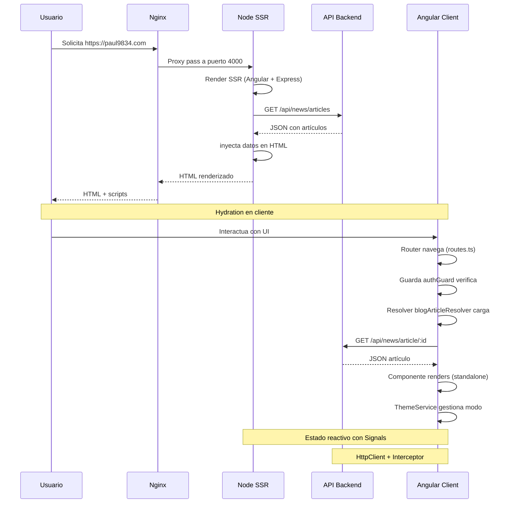

# Diagrama de Flujo de Datos - KP Portfolio

```mermaid
sequenceDiagram
    participant U as Usuario
    participant N as Nginx
    participant SSR as Node SSR
    participant A as API Backend
    participant C as Angular Client

    U->>N: Solicita https://paul9834.com
    N->>SSR: Proxy pass a puerto 4000
    SSR->>SSR: Render SSR (Angular + Express)
    SSR->>A: GET /api/news/articles
    A-->>SSR: JSON con artículos
    SSR->>SSR:inyecta datos en HTML
    SSR-->>N: HTML renderizado
    N-->>U: HTML + scripts
    
    Note over U,C: Hydration en cliente
    
    U->>C: Interactua con UI
    C->>C: Router navega (routes.ts)
    C->>C: Guarda authGuard verifica
    C->>C: Resolver blogArticleResolver carga
    C->>A: GET /api/news/article/:id
    A-->>C: JSON artículo
    C->>C: Componente renders (standalone)
    C->>C: ThemeService gestiona modo
    
    Note over C,SSR: Estado reactivo con Signals
    Note over C,A: HttpClient + Interceptor
```
